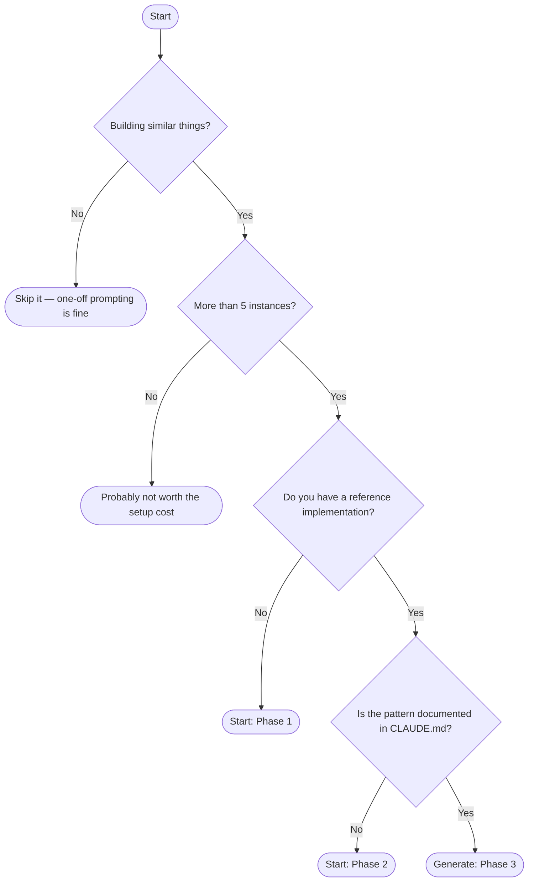
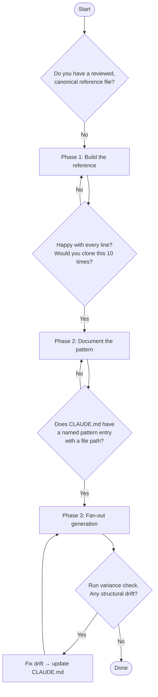

Use this when you're deciding whether or how to apply the pattern.

---

## Should I use a permutation framework?



**Skip it** — Run a single prompt per feature. No framework needed.

**Probably not worth it** — Setup cost is real. Below 5 instances, time spent on Phases 1–2 won't pay back.

**Start: Phase 1** — Build the first 2–3 instances by hand. Review every line. That output becomes your canonical reference file.

**Start: Phase 2** — You have a working reference but it's only in your head. Write it into `CLAUDE.md` with a concrete file pointer before generating anything else.

**Generate: Phase 3** — Both prerequisites are met. Fan out the remaining instances in one prompt referencing the pattern.

---

## Which phase are you in?



**Phase 1 exit condition** — You have one file you'd be comfortable pointing a new engineer at and saying "all instances should look like this." If you'd hesitate, keep refining.

**Phase 2 exit condition** — `CLAUDE.md` contains a named section, a concrete file path (not an abstract description), and explicit decisions about the non-obvious parts: loading, empty state, error state, pagination.

**Phase 3 exit condition** — A diff between any two generated files shows only data-specific differences — column names, endpoints, field types. Structural code is identical.

**Drift loop** — If the variance check surfaces deviations, fix the root cause in `CLAUDE.md`, not just the individual file. Each fix sharpens every future generation.

---

<Tip>
Run this after every batch generation to catch drift before it compounds:

```
"Compare the error handling in OrdersTable, ProductsTable, and InvoicesTable.
Flag any deviations from the pattern in UsersTable."
```
</Tip>

---

**← Back to [Style Library](/patterns/permutation-frameworks/overview)**
